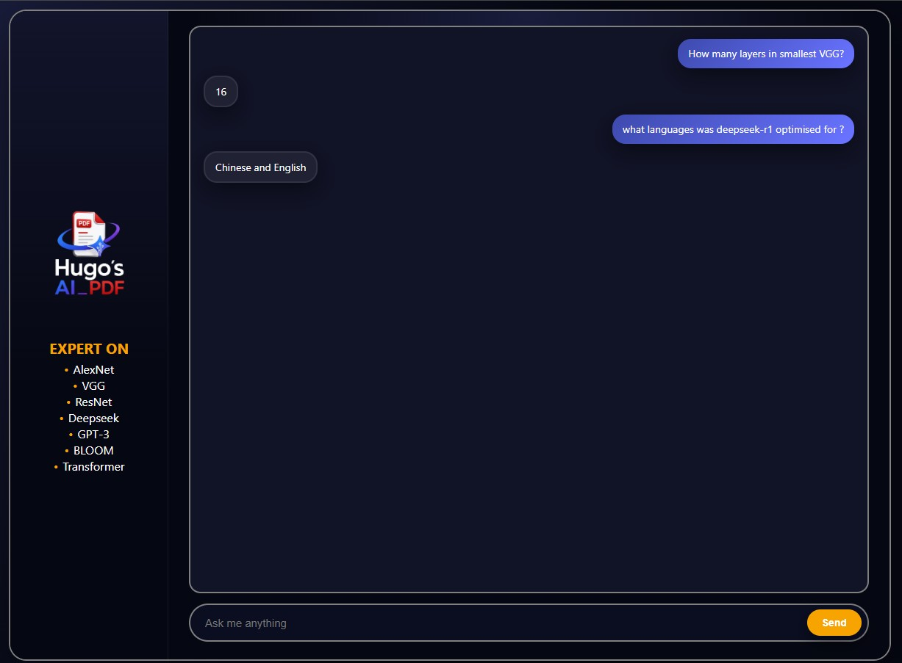

# Hugo's AI_PDF

**Hugo's AI_PDF** est une application de chatbot RAG (*Retrieval-Augmented Generation*) permettant de poser des questions sur un ensemble de documents PDF de recherche.  
Le projet indexe les fichiers PDF, retrouve les passages les plus pertinents avec FAISS, puis génère ou extrait une réponse courte à partir du contenu trouvé.

L'application est spécialisée sur plusieurs articles/modèles d'intelligence artificielle :

- AlexNet
- VGG
- ResNet
- Deepseek
- GPT-3
- BLOOM
- Transformer

---

## Aperçu de l'application



---

## Objectif du projet

Le but du projet est de créer un assistant capable de répondre à des questions précises à partir de fichiers PDF locaux.

Exemples de questions possibles :

```text
How many layers in smallest VGG?
What languages was DeepSeek-R1 optimised for?
What is the main contribution of AlexNet?
What is the architecture of ResNet based on?
```

L'application ne répond pas à partir d'une connaissance générale externe : elle utilise uniquement les passages retrouvés dans les documents PDF indexés.

---

## Fonctionnement général

Le projet fonctionne en deux grandes étapes.

### 1. Vectorisation des PDF

Le script `vectorize.py` :

1. lit les fichiers PDF présents dans le dossier `research/` ;
2. extrait le texte de chaque PDF ;
3. nettoie le texte extrait ;
4. découpe les documents en petits morceaux appelés *chunks* ;
5. transforme ces chunks en vecteurs numériques avec un modèle d'embedding ;
6. construit un index FAISS ;
7. sauvegarde l'index dans le dossier `.faiss_index/`.

Une fois cette étape réalisée, l'index peut être réutilisé directement par l'application.

### 2. Interface de chat

Le script `app.py` :

1. charge l'index FAISS ;
2. reçoit une question depuis l'interface web ;
3. recherche les passages les plus proches de la question ;
4. réordonne les passages avec un reranker ;
5. extrait une réponse courte depuis le contexte retrouvé ;
6. renvoie la réponse à l'interface Flask.

---

## Architecture du projet

```text
HUGO-S_AI_PDF/
│
├── app.py
├── vectorize.py
├── README.md
├── logo.png
├── chatbot_picture.jpg
│
├── research/
│   ├── Alexnet.pdf
│   ├── BLOOM.pdf
│   ├── Deepseek.pdf
│   ├── GPT3.pdf
│   ├── ResNet.pdf
│   ├── Transformers.pdf
│   └── VGG.pdf
│
├── templates/
│   └── index.html
│
├── static/
│   ├── app.js
│   ├── styles.css
│   └── css/
│
└── .faiss_index/
    ├── index.faiss
    └── index.pkl
```

---

## Rôle des principaux fichiers

### `app.py`

Fichier principal de l'application.

Il contient :

- la configuration des modèles ;
- le chargement de l'index FAISS ;
- le pipeline de question-réponse ;
- le reranking des documents ;
- le serveur Flask ;
- les routes web utilisées par l'interface.

Par défaut, il lance l'interface web à l'adresse :

```text
http://localhost:5000
```

Il est aussi possible d'utiliser le mode terminal avec :

```bash
python app.py --cli
```

---

### `vectorize.py`

Script à exécuter une fois avant de lancer l'application.

Il sert à créer l'index vectoriel à partir des PDF du dossier `research/`.

Commande :

```bash
python vectorize.py
```

Ce script produit un dossier `.faiss_index/` contenant l'index FAISS sauvegardé.

---

### `research/`

Dossier contenant les fichiers PDF à indexer.

Dans ce projet, il contient notamment :

```text
Alexnet.pdf
BLOOM.pdf
Deepseek.pdf
GPT3.pdf
ResNet.pdf
Transformers.pdf
VGG.pdf
```

Chaque fichier PDF est chargé, découpé, vectorisé puis ajouté à l'index.

---

### `templates/index.html`

Fichier HTML de l'interface web.

Il définit :

- la barre latérale ;
- le logo ;
- la liste des sujets couverts ;
- la zone d'affichage des messages ;
- le champ de saisie ;
- le bouton d'envoi.

---

### `static/app.js`

Fichier JavaScript utilisé côté navigateur.

Il permet généralement de :

- récupérer la question écrite par l'utilisateur ;
- envoyer la question au backend Flask ;
- recevoir la réponse ;
- l'afficher dans la fenêtre de chat.

---

### `static/styles.css`

Fichier CSS de l'application.

Il contrôle l'apparence visuelle de l'interface :

- mise en page ;
- couleurs ;
- police ;
- boutons ;
- bulles de messages ;
- sidebar ;
- responsive design éventuel.

---

## Technologies utilisées

Le projet utilise principalement :

- **Python** : langage principal du backend ;
- **Flask** : serveur web léger pour l'interface ;
- **LangChain** : chargement, découpage et manipulation des documents ;
- **FAISS** : moteur de recherche vectorielle ;
- **Hugging Face Transformers** : chargement des modèles de langage ;
- **Sentence Transformers** : embeddings et reranking ;
- **PyPDFLoader** : extraction du texte depuis les fichiers PDF ;
- **HTML / CSS / JavaScript** : interface utilisateur.

---

## Modèles utilisés

### Modèle d'embedding

```python
BAAI/bge-small-en-v1.5
```

Ce modèle transforme les morceaux de texte en vecteurs numériques.  
Ces vecteurs sont ensuite stockés dans FAISS pour permettre une recherche sémantique.

---

### Modèle de génération

```python
Qwen/Qwen2.5-0.5B-Instruct
```

Ce modèle est utilisé comme petit modèle instructif pour produire une réponse lorsque l'extraction directe n'est pas suffisante.

---

### Modèle de question-réponse extractive

```python
deepset/roberta-base-squad2
```

Ce modèle cherche directement une réponse courte dans le contexte retrouvé.

---

### Modèle de reranking

```python
cross-encoder/ms-marco-MiniLM-L-6-v2
```

Ce modèle sert à réordonner les passages retrouvés afin de mettre les passages les plus pertinents en premier.

---

## Installation

### 1. Cloner ou ouvrir le projet

Placez-vous dans le dossier du projet :

```bash
cd HUGO-S_AI_PDF
```

---

### 2. Créer un environnement virtuel

Sur Linux ou macOS :

```bash
python3 -m venv .venv
source .venv/bin/activate
```

Sur Windows :

```bash
python -m venv .venv
.venv\Scripts\activate
```

---

### 3. Installer les dépendances

```bash
pip install -U "langchain>=0.2" "langchain-community>=0.2" langchain-core langchain-huggingface transformers torch sentence-transformers faiss-cpu pypdf flask
```

---

## Utilisation

### Étape 1 : placer les PDF dans `research/`

Vérifiez que vos fichiers PDF sont bien dans le dossier :

```text
research/
```

Exemple :

```text
research/Alexnet.pdf
research/VGG.pdf
research/ResNet.pdf
```

---

### Étape 2 : créer l'index FAISS

Avant de lancer l'application, exécutez :

```bash
python vectorize.py
```

Cette commande lit les PDF, les découpe et construit l'index vectoriel.

Vous devriez obtenir un message de ce type :

```text
[VECTORIZER] Loading and chunking PDF...
[VECTORIZER] Chunks: ...
[VECTORIZER] Building FAISS index at .faiss_index ...
[VECTORIZER] Done. You can now run: python app.py
```

---

### Étape 3 : lancer l'application web

```bash
python app.py
```

Puis ouvrez dans votre navigateur :

```text
http://localhost:5000
```

---

### Étape 4 : poser une question

Exemple :

```text
How many layers in smallest VGG?
```

L'application recherche les passages pertinents dans les PDF et renvoie une réponse courte.

---

## Mode terminal

Le projet peut aussi fonctionner sans interface web.

Pour lancer le mode CLI :

```bash
python app.py --cli
```

Vous pouvez ensuite poser une question directement dans le terminal :

```text
> How many layers in smallest VGG?
```

---

## Pipeline RAG détaillé

Le pipeline utilisé dans ce projet est le suivant :

```text
Question utilisateur
        │
        ▼
Recherche FAISS
        │
        ▼
Sélection de documents proches
        │
        ▼
Reranking avec CrossEncoder
        │
        ▼
Construction du contexte
        │
        ▼
Question-answering extractif
        │
        ▼
Fallback génération contrôlée
        │
        ▼
Réponse courte affichée dans l'interface
```

---

## Pourquoi utiliser FAISS ?

FAISS permet d'effectuer une recherche rapide dans un grand nombre de vecteurs.

Au lieu de chercher uniquement des mots exacts, le système compare le sens de la question avec le sens des morceaux de texte indexés.

Cela permet de retrouver des passages pertinents même si l'utilisateur n'utilise pas exactement les mêmes mots que le PDF.

---

## Nettoyage et découpage des PDF

Dans `vectorize.py`, le texte extrait est nettoyé avec plusieurs opérations :

- suppression des coupures de mots dues aux retours à la ligne ;
- remplacement des retours à la ligne par des espaces ;
- suppression des espaces multiples ;
- découpage en chunks de taille contrôlée.

Configuration utilisée :

```python
chunk_size = 800
chunk_overlap = 120
```

Le chevauchement permet de ne pas perdre le contexte entre deux morceaux voisins.

---

## Gestion des réponses

L'application essaie d'abord d'extraire une réponse directement depuis le contexte avec un modèle de question-réponse.

Si la réponse est trop faible ou trop générique, elle utilise un petit modèle génératif avec une contrainte importante :

> la réponse doit être copiée depuis le contexte fourni.

Cela limite les hallucinations et force le modèle à rester proche des documents PDF.

---

## Limites du projet

Le projet présente certaines limites :

- la qualité des réponses dépend de la qualité d'extraction du texte PDF ;
- certains PDF scientifiques peuvent contenir des formules ou tableaux difficiles à extraire ;
- les réponses sont volontairement très courtes ;
- le modèle utilisé est léger, donc moins performant qu'un grand modèle ;
- si l'information n'est pas dans les PDF indexés, l'application doit répondre qu'elle ne sait pas.

---

## Améliorations possibles

Plusieurs améliorations peuvent être ajoutées :

- afficher les sources utilisées pour répondre ;
- afficher le nom du PDF et la page du passage retrouvé ;
- ajouter un système d'upload de PDF depuis l'interface ;
- permettre de supprimer ou reconstruire l'index depuis le navigateur ;
- utiliser un modèle de génération plus puissant ;
- améliorer le design responsive ;
- ajouter un historique de conversation ;
- ajouter un bouton pour vider le chat ;
- ajouter un indicateur de chargement pendant la génération ;
- gérer plusieurs collections de documents.

---

## Problèmes fréquents

### Erreur : index FAISS introuvable

Message possible :

```text
[ERROR] Vector index not found. Run: python vectorize.py
```

Solution :

```bash
python vectorize.py
```

Puis relancer :

```bash
python app.py
```

---

### Les modèles se téléchargent lentement

Au premier lancement, les modèles Hugging Face peuvent être téléchargés automatiquement.  
Cela peut prendre plusieurs minutes selon la connexion internet.

---

### Le chatbot répond `I don't know`

Cela peut arriver si :

- l'information n'est pas présente dans les PDF ;
- l'index n'a pas été mis à jour ;
- la question est trop vague ;
- le passage pertinent n'a pas été retrouvé ;
- le PDF a mal été extrait.

Essayez de reformuler la question ou de reconstruire l'index avec :

```bash
python vectorize.py
```

---

## Exemple de session

```text
User: How many layers in smallest VGG?
Bot: 16

User: What languages was DeepSeek-R1 optimised for?
Bot: Chinese and English
```

---

## Auteur

Projet réalisé par **Hugo Kennedy**.

---

## Licence

Ce projet est destiné à un usage pédagogique et académique.
